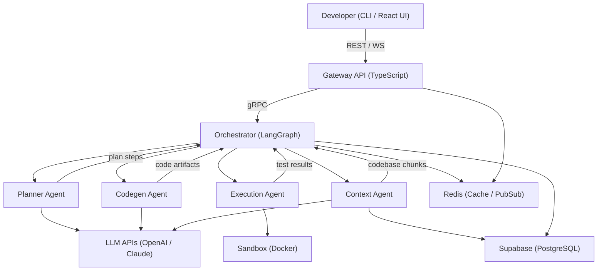
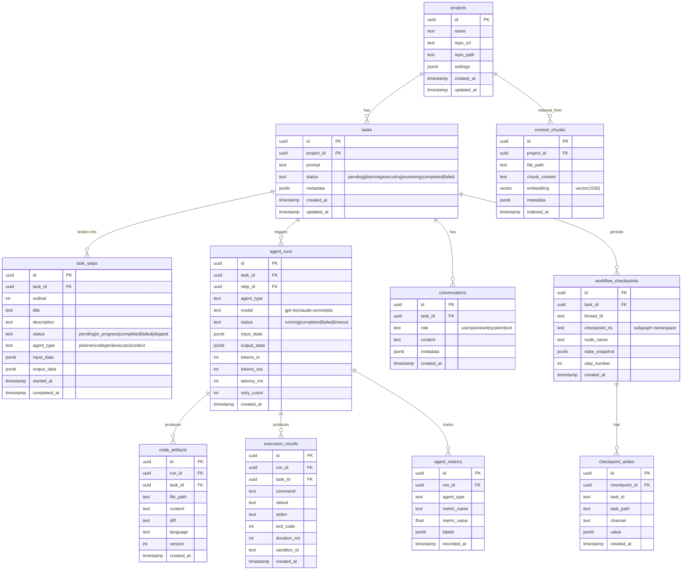
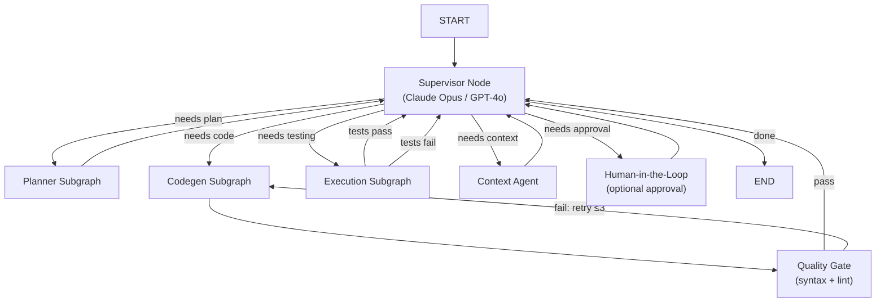

# Architecture — Agentic Developer Environment

## Table of Contents

1. [High-Level System Architecture](#1-high-level-system-architecture)
2. [Modular Folder Structure](#2-modular-folder-structure)
3. [Database Schema](#3-database-schema)
4. [API Contracts](#4-api-contracts)
5. [LangGraph Orchestration Design](#5-langgraph-orchestration-design)
6. [Redis Cache Strategy](#6-redis-cache-strategy)
7. [Docker Sandbox Design](#7-docker-sandbox-design)

---

## 1. High-Level System Architecture

The system follows a **Supervisor + Pipeline** multi-agent pattern orchestrated by LangGraph. A developer submits a task via CLI or React UI; the Gateway API routes it to the Orchestrator, which decomposes and delegates work across specialized agents, each with isolated tool access.



### Component Responsibilities

| Component | Language | Role |
|-----------|----------|------|
| **Gateway API** | TypeScript (Fastify) | REST API + WebSocket server; authenticates requests, rate-limits, and bridges clients to the orchestrator via gRPC |
| **Orchestrator** | Python (LangGraph) | Supervisor + Pipeline engine; decomposes tasks, routes work to agent subgraphs, checkpoints state |
| **Planner Agent** | Python | Decomposes a developer prompt into an ordered list of `TaskStep` objects using an LLM |
| **Codegen Agent** | Python | Generates and modifies code files given a step description and codebase context |
| **Execution Agent** | Python | Runs tests and arbitrary commands inside an ephemeral Docker sandbox |
| **Context Agent** | Python | Indexes the codebase (AST chunking + embeddings) and answers RAG retrieval queries |
| **Sandbox Service** | Python (gRPC) | Manages Docker container lifecycle for isolated execution |
| **Supabase** | PostgreSQL + pgvector | Persistent store for tasks, artifacts, checkpoints, and vector embeddings |
| **Redis** | Redis | LLM response cache, rate-limit counters, and pub/sub event bus between Orchestrator and Gateway |

---

## 2. Modular Folder Structure

```
agentic-developer-environment/
├── CLAUDE.md                          # Root AI context file
├── README.md
├── docker-compose.yml                 # All services + infra
├── .env.example
├── Makefile                           # build / test / lint / dev commands
│
├── docs/
│   ├── architecture.md                # Full system design (this file)
│   ├── api-contracts.md               # REST + gRPC + WebSocket specs
│   ├── database-schema.md             # ERD + table definitions + DDL
│   └── decisions/                     # Architecture Decision Records (ADRs)
│
├── packages/
│   ├── shared-types/                  # Pydantic models + TS types
│   │   ├── python/
│   │   │   └── ade_types/
│   │   │       ├── task.py            # Task, TaskStep, TaskStatus
│   │   │       ├── agent.py           # AgentRun, AgentMetrics
│   │   │       ├── artifact.py        # CodeArtifact, ExecutionResult
│   │   │       └── project.py         # Project, ContextChunk
│   │   └── typescript/
│   │       └── src/
│   │           └── index.ts           # Mirrored TS types
│   └── proto/                         # gRPC service definitions
│       ├── orchestrator.proto
│       ├── sandbox.proto
│       ├── context.proto
│       └── buf.gen.yaml               # Protobuf codegen config
│
├── services/
│   ├── gateway/                       # TypeScript — REST API + WebSocket
│   │   ├── src/
│   │   │   ├── routes/
│   │   │   │   ├── projects.ts
│   │   │   │   ├── tasks.ts
│   │   │   │   ├── artifacts.ts
│   │   │   │   └── metrics.ts
│   │   │   ├── middleware/
│   │   │   │   ├── auth.ts
│   │   │   │   ├── rateLimit.ts
│   │   │   │   └── validation.ts
│   │   │   ├── ws/
│   │   │   │   └── taskStream.ts      # WebSocket real-time events
│   │   │   ├── grpc/
│   │   │   │   └── clients.ts         # gRPC client stubs
│   │   │   └── index.ts
│   │   ├── package.json
│   │   ├── tsconfig.json
│   │   └── Dockerfile
│   │
│   ├── orchestrator/                  # Python — LangGraph engine
│   │   ├── src/
│   │   │   ├── graphs/
│   │   │   │   ├── supervisor.py      # Top-level supervisor graph
│   │   │   │   ├── planning.py        # Planner subgraph
│   │   │   │   ├── codegen.py         # Codegen subgraph
│   │   │   │   └── execution.py       # Execution subgraph
│   │   │   ├── agents/
│   │   │   │   ├── planner.py         # Task decomposition agent
│   │   │   │   ├── codegen.py         # Code generation agent
│   │   │   │   ├── executor.py        # Test execution agent
│   │   │   │   └── context.py         # Context retrieval agent
│   │   │   ├── state/
│   │   │   │   ├── workflow.py        # WorkflowState (Pydantic)
│   │   │   │   └── checkpointer.py    # Supabase checkpoint saver
│   │   │   ├── tools/
│   │   │   │   ├── file_ops.py        # Read/write codebase files
│   │   │   │   ├── search.py          # Semantic search over codebase
│   │   │   │   ├── sandbox.py         # Execute code in sandbox
│   │   │   │   └── git_ops.py         # Git operations
│   │   │   ├── prompts/
│   │   │   │   ├── planner.md
│   │   │   │   ├── codegen.md
│   │   │   │   └── executor.md
│   │   │   ├── events/
│   │   │   │   └── publisher.py       # Redis pub/sub event emitter
│   │   │   ├── server.py              # gRPC server entrypoint
│   │   │   └── config.py
│   │   ├── tests/
│   │   ├── pyproject.toml
│   │   └── Dockerfile
│   │
│   ├── sandbox/                       # Python — Docker isolation
│   │   ├── src/
│   │   │   ├── runners/
│   │   │   │   ├── python_runner.py
│   │   │   │   ├── node_runner.py
│   │   │   │   └── generic_runner.py
│   │   │   ├── isolation/
│   │   │   │   ├── container.py       # Docker container lifecycle
│   │   │   │   └── network.py         # Network isolation policies
│   │   │   ├── server.py              # gRPC server
│   │   │   └── config.py
│   │   ├── images/                    # Sandbox base Dockerfiles
│   │   │   ├── python.Dockerfile
│   │   │   └── node.Dockerfile
│   │   ├── pyproject.toml
│   │   └── Dockerfile
│   │
│   └── context/                       # Python — RAG + codebase indexing
│       ├── src/
│       │   ├── indexer/
│       │   │   ├── chunker.py         # AST-aware code chunking
│       │   │   ├── embedder.py        # Embedding generation
│       │   │   └── watcher.py         # File-change watcher
│       │   ├── retriever/
│       │   │   ├── search.py          # Vector similarity search
│       │   │   └── reranker.py        # Result reranking
│       │   ├── server.py              # gRPC server
│       │   └── config.py
│       ├── pyproject.toml
│       └── Dockerfile
│
├── cli/                               # Python CLI (Typer)
│   ├── src/
│   │   ├── commands/
│   │   │   ├── task.py                # ade task "build auth module"
│   │   │   ├── status.py              # ade status <task-id>
│   │   │   ├── project.py             # ade project init / link
│   │   │   └── logs.py                # ade logs <task-id>
│   │   ├── display/
│   │   │   └── rich_output.py         # Rich terminal output
│   │   └── main.py                    # Typer app entrypoint
│   ├── pyproject.toml
│   └── README.md
│
├── ui/                                # React TypeScript frontend
│   ├── public/
│   ├── src/
│   │   ├── components/
│   │   │   ├── TaskSubmit.tsx
│   │   │   ├── TaskTimeline.tsx       # Step-by-step agent progress
│   │   │   ├── CodeDiff.tsx           # Diff viewer for artifacts
│   │   │   ├── MetricsDashboard.tsx
│   │   │   └── AgentChat.tsx          # Real-time agent interaction
│   │   ├── pages/
│   │   │   ├── Dashboard.tsx
│   │   │   ├── TaskDetail.tsx
│   │   │   └── ProjectSettings.tsx
│   │   ├── hooks/
│   │   │   ├── useTask.ts
│   │   │   ├── useWebSocket.ts
│   │   │   └── useMetrics.ts
│   │   ├── api/
│   │   │   └── client.ts              # Typed API client
│   │   ├── store/
│   │   │   └── index.ts               # Zustand state management
│   │   ├── main.tsx                   # React entrypoint
│   │   └── App.tsx
│   ├── index.html                     # Vite HTML entry
│   ├── tailwind.config.ts             # Tailwind CSS configuration
│   ├── postcss.config.js              # PostCSS plugins (Tailwind, autoprefixer)
│   ├── package.json
│   ├── tsconfig.json
│   ├── vite.config.ts
│   └── Dockerfile
│
├── infra/
│   ├── supabase/
│   │   ├── migrations/                # Numbered SQL migrations
│   │   │   ├── 001_projects.sql
│   │   │   ├── 002_tasks.sql
│   │   │   ├── 003_agent_runs.sql
│   │   │   ├── 004_artifacts.sql
│   │   │   ├── 005_context.sql
│   │   │   ├── 006_metrics.sql
│   │   │   └── 007_checkpoint_writes.sql  # checkpoint_ns + checkpoint_writes table
│   │   └── seed.sql
│   └── docker/
│       └── nginx.conf                 # Reverse proxy config
│
└── tests/
    ├── integration/
    │   ├── test_workflow_e2e.py
    │   └── test_sandbox.py
    └── fixtures/
        └── sample_project/
```

---

## 3. Database Schema

### Entity Relationship Diagram



### Key Schema Decisions

- **`context_chunks.embedding`** — Uses the `pgvector` extension for native vector similarity search directly in Supabase, eliminating the need for a separate vector database.
- **`workflow_checkpoints`** — LangGraph checkpoint persistence stored in Supabase so workflows survive service restarts and can be replayed or forked from any historical state. The `checkpoint_ns` column stores the LangGraph subgraph namespace, forming a composite index `(thread_id, checkpoint_ns, step_number DESC)` for efficient latest-checkpoint lookups.
- **`checkpoint_writes` (separate table)** — Pending channel writes from `aput_writes` are stored as individual rows rather than a JSONB array inside `workflow_checkpoints`. This matches the `langgraph-checkpoint-postgres` design: pure-append writes avoid row-level update contention when multiple nodes write concurrently, and `ON DELETE CASCADE` from `workflow_checkpoints` keeps cleanup automatic.
- **`agent_runs` tracks `tokens_in`/`tokens_out`/`latency_ms`** — Enables per-agent cost analysis and reliability metrics; feeds the `/api/v1/metrics` endpoint.
- **`task_steps.ordinal`** — Ordered integer enables the planner to prescribe step sequence while allowing the supervisor to skip, retry, or reorder steps at runtime.
- **RLS policies** — All tables have Supabase Row-Level Security scoped to `project_id` for multi-tenant isolation. Application code never bypasses RLS.

### DDL Summary

Full DDL lives in `infra/supabase/migrations/`. Key table creation order:

```sql
-- Enable pgvector before creating context_chunks
CREATE EXTENSION IF NOT EXISTS vector;

-- 001_projects.sql
CREATE TABLE projects (
    id          UUID PRIMARY KEY DEFAULT gen_random_uuid(),
    name        TEXT NOT NULL,
    repo_url    TEXT,
    repo_path   TEXT,
    settings    JSONB NOT NULL DEFAULT '{}',
    created_at  TIMESTAMPTZ NOT NULL DEFAULT now(),
    updated_at  TIMESTAMPTZ NOT NULL DEFAULT now()
);

-- 002_tasks.sql
CREATE TABLE tasks (
    id          UUID PRIMARY KEY DEFAULT gen_random_uuid(),
    project_id  UUID NOT NULL REFERENCES projects(id) ON DELETE CASCADE,
    prompt      TEXT NOT NULL,
    status      TEXT NOT NULL DEFAULT 'pending'
                    CHECK (status IN ('pending','planning','executing','reviewing','completed','failed')),
    metadata    JSONB NOT NULL DEFAULT '{}',
    created_at  TIMESTAMPTZ NOT NULL DEFAULT now(),
    updated_at  TIMESTAMPTZ NOT NULL DEFAULT now()
);

-- 005_context.sql  (abbreviated)
CREATE TABLE context_chunks (
    id             UUID PRIMARY KEY DEFAULT gen_random_uuid(),
    project_id     UUID NOT NULL REFERENCES projects(id) ON DELETE CASCADE,
    file_path      TEXT NOT NULL,
    chunk_content  TEXT NOT NULL,
    embedding      vector(1536),
    metadata       JSONB NOT NULL DEFAULT '{}',
    indexed_at     TIMESTAMPTZ NOT NULL DEFAULT now()
);
CREATE INDEX ON context_chunks USING ivfflat (embedding vector_cosine_ops) WITH (lists = 100);

-- 007_checkpoint_writes.sql
-- Add subgraph namespace column to workflow_checkpoints and update its index
ALTER TABLE workflow_checkpoints
    ADD COLUMN checkpoint_ns TEXT NOT NULL DEFAULT '';

CREATE INDEX ON workflow_checkpoints (thread_id, checkpoint_ns, step_number DESC);

-- Separate table for pending channel writes (mirrors langgraph-checkpoint-postgres design)
CREATE TABLE checkpoint_writes (
    id             UUID PRIMARY KEY DEFAULT gen_random_uuid(),
    checkpoint_id  UUID NOT NULL REFERENCES workflow_checkpoints(id) ON DELETE CASCADE,
    task_id        TEXT NOT NULL,
    task_path      TEXT NOT NULL DEFAULT '',
    channel        TEXT NOT NULL,
    value          JSONB NOT NULL,
    created_at     TIMESTAMPTZ NOT NULL DEFAULT now()
);
CREATE INDEX ON checkpoint_writes (checkpoint_id);
```

---

## 4. API Contracts

### 4a. Gateway REST API

Base URL: `http://localhost:3000/api/v1`

| Method | Endpoint | Description |
|--------|----------|-------------|
| `POST` | `/projects` | Register a project (repo URL or local path) |
| `GET` | `/projects/:id` | Get project details |
| `POST` | `/tasks` | Submit a developer task |
| `GET` | `/tasks/:id` | Get task with current status |
| `GET` | `/tasks/:id/steps` | List planner-generated steps |
| `POST` | `/tasks/:id/steps/:stepId/approve` | Human-in-the-loop step approval |
| `GET` | `/tasks/:id/artifacts` | Get generated code artifacts |
| `GET` | `/tasks/:id/results` | Get sandbox execution results |
| `GET` | `/metrics` | Agent performance metrics |
| `WS` | `/ws/tasks/:id` | Real-time streaming of agent events |

#### Example: Submit a task

```http
POST /api/v1/tasks
Content-Type: application/json

{
  "project_id": "550e8400-e29b-41d4-a716-446655440000",
  "prompt": "Build a JWT authentication module with refresh token support"
}
```

```http
HTTP/1.1 202 Accepted
Content-Type: application/json

{
  "task_id": "7f3d9a1b-2c4e-4f8a-b6d3-1a2b3c4d5e6f",
  "status": "pending",
  "ws_url": "/ws/tasks/7f3d9a1b-2c4e-4f8a-b6d3-1a2b3c4d5e6f"
}
```

### 4b. Internal gRPC Services

#### OrchestratorService (`packages/proto/orchestrator.proto`)

```protobuf
service OrchestratorService {
  // Kick off the supervisor graph; streams events back as they occur
  rpc RunWorkflow(WorkflowRequest) returns (stream WorkflowEvent);
  rpc GetWorkflowStatus(WorkflowId) returns (WorkflowStatus);
  rpc CancelWorkflow(WorkflowId) returns (Ack);
}

message WorkflowRequest {
  string task_id    = 1;
  string project_id = 2;
  string prompt     = 3;
  map<string, string> metadata = 4;
}

message WorkflowEvent {
  string event_type = 1;   // step.started, artifact.created, etc.
  string step_id    = 2;
  string payload    = 3;   // JSON-encoded event data
  int64  timestamp  = 4;
}
```

#### SandboxService (`packages/proto/sandbox.proto`)

```protobuf
service SandboxService {
  rpc CreateSandbox(SandboxConfig) returns (SandboxInfo);
  rpc Execute(ExecutionRequest) returns (ExecutionResult);
  rpc DestroySandbox(SandboxId) returns (Ack);
}

message SandboxConfig {
  string runtime   = 1;   // "python3.12" | "node22"
  int32  cpu_cores = 2;   // default: 1
  int32  memory_mb = 3;   // default: 512
  int32  timeout_s = 4;   // default: 60
}

message ExecutionRequest {
  string sandbox_id = 1;
  string command    = 2;
  string code_path  = 3;  // mounted volume path
  map<string, string> env = 4;
}
```

#### ContextService (`packages/proto/context.proto`)

```protobuf
service ContextService {
  rpc IndexRepository(IndexRequest) returns (IndexResult);
  rpc RetrieveContext(ContextQuery) returns (ContextChunks);
  rpc WatchChanges(WatchRequest) returns (stream ChangeEvent);
}

message ContextQuery {
  string project_id = 1;
  string query      = 2;
  int32  top_k      = 3;   // default: 10
  float  threshold  = 4;   // cosine similarity threshold, default: 0.7
}
```

### 4c. WebSocket Event Schema

Events streamed over `/ws/tasks/:id` (JSON-encoded):

| Event | Payload Fields | Description |
|-------|---------------|-------------|
| `workflow.started` | `task_id` | Supervisor graph began |
| `step.started` | `step_id`, `agent_type`, `title` | Agent picked up a step |
| `step.progress` | `step_id`, `message` | Intermediate output / LLM streaming token |
| `step.completed` | `step_id`, `output` | Step finished successfully |
| `step.failed` | `step_id`, `error` | Step failed (may retry) |
| `artifact.created` | `artifact_id`, `file_path`, `diff` | Code generated or modified |
| `execution.result` | `result_id`, `exit_code`, `stdout`, `stderr` | Sandbox run completed |
| `workflow.completed` | `summary`, `artifact_ids` | All steps done |
| `workflow.error` | `error`, `step_id` | Unrecoverable failure |

---

## 5. LangGraph Orchestration Design

### Supervisor Graph

Defined in `services/orchestrator/src/graphs/supervisor.py`.



### WorkflowState Schema

```python
class WorkflowState(TypedDict):
    task_id: str
    project_id: str
    prompt: str
    steps: list[TaskStep]           # planner output
    current_step_index: int
    context_chunks: list[str]       # retrieved codebase context
    artifacts: list[CodeArtifact]   # generated files
    execution_results: list[ExecutionResult]
    messages: list[BaseMessage]     # LangChain message history
    next_agent: str                 # supervisor routing decision
    retry_count: int                # quality gate retry counter
    requires_approval: bool
    error: str | None
```

### Agent Tool Permissions

| Agent | Read Files | Write Files | Execute Code | Vector Search | Git Ops |
|-------|-----------|------------|-------------|--------------|---------|
| Planner | — | — | — | — | — |
| Codegen | ✓ | ✓ | — | ✓ | — |
| Executor | ✓ | — | ✓ (sandbox only) | — | — |
| Context | ✓ | — | — | ✓ | — |
| Supervisor | — | — | — | — | — |

### Key Design Decisions

1. **Supervisor routes, never executes.** The supervisor LLM call only decides which agent subgraph to invoke next based on the current `WorkflowState`. It never directly modifies state or calls tools.

2. **Quality gates before returning to supervisor.** Codegen output is syntax-checked and linted before the supervisor sees it. Failures trigger a local retry loop (max 3 iterations) inside the codegen subgraph, keeping the supervisor's context clean.

3. **Checkpointing after every node.** A custom `SupabaseCheckpointer` saves `WorkflowState` to `workflow_checkpoints` after each node execution. This enables:
   - Resume-from-failure after service restart
   - Time-travel debugging (replay from any checkpoint)
   - Forking workflows to compare alternative approaches

4. **Model routing by task complexity.** Supervisor uses a strong model (Claude Opus / GPT-4o) for routing accuracy. Worker agents use faster, cheaper models (Claude Sonnet / GPT-4o-mini) for cost efficiency.

5. **Subgraph encapsulation.** Each agent runs as an independent LangGraph subgraph with its own state transformation. The supervisor communicates only through the shared `WorkflowState`, never by calling agent internals directly.

---

## 6. Redis Cache Strategy

Redis is used for four distinct purposes, each with a dedicated key namespace:

### LLM Response Cache (`llm:cache:{hash}`)

- Key: `SHA256(model + prompt + temperature)`
- Value: full LLM response JSON
- TTL: 1 hour
- Purpose: Deduplicate identical LLM calls (e.g., repeated planning steps for similar prompts)

### Context Chunk Cache (`ctx:{project_id}:{chunk_id}`)

- Hot codebase chunks cached to avoid repeated Supabase/embedding lookups
- TTL: 15 minutes
- Invalidated on file-change events from `context/src/indexer/watcher.py`

### Rate Limiting (`ratelimit:{project_id}:{minute}`)

- Token-bucket counters per project per minute
- Enforced in Gateway middleware (`services/gateway/src/middleware/rateLimit.ts`)
- Prevents runaway LLM spend from a single project

### Pub/Sub Event Bus (`workflow:events:{task_id}`)

- Orchestrator publishes `WorkflowEvent` JSON to Redis channels as each node completes
- Gateway subscribes on task creation and fans out messages to connected WebSocket clients
- Decouples Gateway and Orchestrator — no direct HTTP polling or shared memory

```
Orchestrator                Redis                  Gateway (WebSocket)
    |                          |                          |
    |--PUBLISH workflow:events:task-123-->|                |
    |                          |--subscriber notification->|
    |                          |                    |--ws.send(event)-->Client
```

### Session State (`session:{token}`)

- CLI authentication tokens and active workflow references
- TTL: 24 hours

---

## 7. Docker Sandbox Design

The sandbox service provides fully isolated execution for the Executor agent. Every command runs in a fresh, ephemeral container.

### Lifecycle

```
ExecutionRequest
      │
      ▼
CreateSandbox()
  • Pull pre-built image (python:3.12-ade or node:22-ade)
  • Mount code as read-only volume at /workspace
  • Apply resource limits + security profile
      │
      ▼
Execute(command)
  • Run command inside container
  • Stream stdout/stderr back to gRPC client
  • Kill container on timeout
      │
      ▼
DestroySandbox()
  • docker rm --force
  • Clean up temp volumes
```

### Resource Limits

| Resource | Limit |
|----------|-------|
| CPU | 1 core (via `--cpus=1`) |
| Memory | 512 MB (via `--memory=512m`) |
| Execution timeout | 60 seconds |
| Network access | None (via `--network=none`) |
| Root filesystem | Read-only (via `--read-only`) |
| Writable path | `/tmp` only |
| User | Non-root (`--user=1000:1000`) |

### Security Profile

- Dropped Linux capabilities: `ALL` (only essential caps re-added if needed)
- seccomp profile: Docker default + custom deny list for `ptrace`, `mount`, `clone` with new namespaces
- No access to host Docker socket
- Separate Docker network with no routing to host or other containers

### Image Variants

**`images/python.Dockerfile`** (Python 3.12):
- Base: `python:3.12-slim`
- Includes: `pytest`, `coverage`, `black`, `ruff`, `mypy`
- Use for: Python code generation and test execution

**`images/node.Dockerfile`** (Node 22):
- Base: `node:22-slim`
- Includes: `jest`, `vitest`, `eslint`, `typescript`, `tsx`
- Use for: TypeScript/JavaScript code generation and test execution

Both images are pre-built and pushed to the project's container registry. The sandbox service pulls them at startup to avoid per-execution pull latency.
